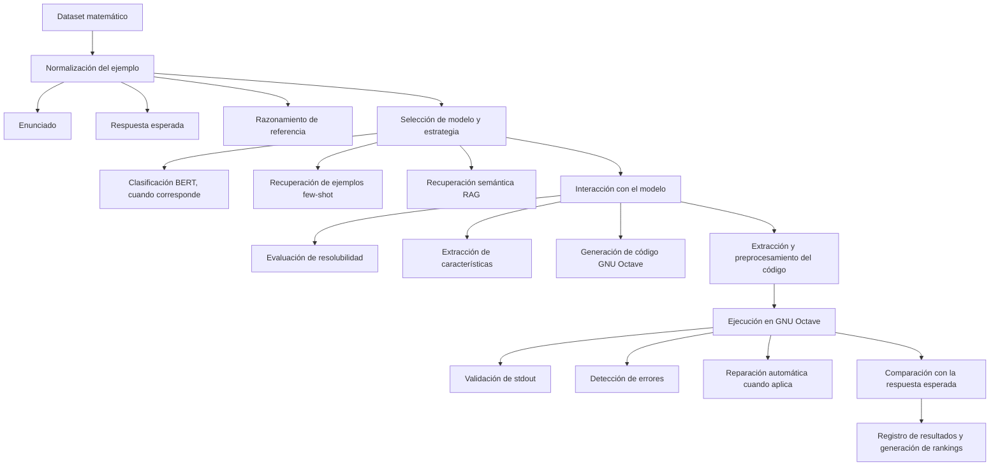

# Resolución de problemas matemáticos mediante LLMs y GNU Octave

> Comparación de modelos de lenguaje (LLMs) y estrategias de prompting para resolver problemas matemáticos mediante la generación automática de código ejecutable en **GNU Octave**.

## Tabla de contenidos

- [Descripción](#descripción)
- [Objetivo del proyecto](#objetivo-del-proyecto)
- [Datasets utilizados](#datasets-utilizados)
- [Modelos evaluados](#modelos-evaluados)
- [Estructura del pipeline](#estructura-del-pipeline)
- [Estrategias analizadas](#estrategias-analizadas)
- [Estrategias para generar explicaciones](#estrategias-para-generar-explicaciones)
- [Estructura del repositorio](#estructura-del-repositorio)
- [Resultados](#resultados)

---

## Descripción

Este proyecto estudia el uso de modelos de lenguaje para resolver problemas matemáticos mediante la generación automática de código ejecutable en **GNU Octave**.

El trabajo compara diferentes modelos y estrategias de prompting —conversacionales, no conversacionales, *few-shot*, RAG y razonamiento paso a paso— para determinar qué combinación produce soluciones más correctas, ejecutables y robustas.

Además de medir si la respuesta final es correcta, el pipeline registra:

- Si el problema puede resolverse computacionalmente.
- El código GNU Octave generado.
- La salida y los errores de ejecución.
- El tiempo de inferencia.
- La capacidad de corregir automáticamente código defectuoso.
- La cobertura y precisión de cada combinación de modelo y estrategia.

---

## Objetivo del proyecto

El objetivo principal es diseñar y evaluar un pipeline capaz de:

1. Recibir un problema matemático escrito en lenguaje natural.
2. Determinar si puede resolverse programáticamente con GNU Octave.
3. Analizar sus datos, incógnitas, restricciones y métodos aplicables.
4. Generar un script de Octave que calcule la solución.
5. Ejecutar y validar automáticamente el código generado.
6. Comparar diferentes modelos de lenguaje y estrategias de prompting.
7. Identificar la combinación de modelo y estrategia con mejor desempeño global.

> **Componentes complementarios:** el proyecto incluye un clasificador BERT multitarea para categorizar problemas matemáticos y un corpus especializado para recuperación de ejemplos mediante RAG.

---

## Datasets utilizados

### GSM8K

**GSM8K** contiene problemas matemáticos verbales, principalmente de aritmética, acompañados por su respuesta y un razonamiento de referencia.

| Partición | Nº de problemas |
|---|---:|
| Conjunto de prueba original | 1.319 |
| Versión completa (train + test) | 8.792 |
| Subconjuntos de desarrollo/evaluación | variable |

Este dataset representa problemas expresados en lenguaje cotidiano que normalmente pueden resolverse mediante cálculos numéricos.

### MATH

**MATH** contiene problemas matemáticos de mayor complejidad, organizados por nivel y área temática. Incluye categorías como álgebra, geometría, teoría de números, conteo y probabilidad, entre otras.

| Partición | Nº de problemas |
|---|---:|
| `math_data` | 5.000 |
| `shuffled_math` | 5.000 |
| Versión completa | 12.500 |
| Subconjunto de experimentos preliminares | 400 |

Cada registro puede incluir el enunciado, nivel de dificultad, tipo de problema, solución razonada y respuesta final.

### Benchmark combinado

Para comparar los modelos y estrategias en condiciones uniformes se construyó un benchmark de **900 problemas**:

| Origen | Ejemplos |
|---|---:|
| GSM8K | 300 |
| `math_data` | 300 |
| `math_shuffled` | 300 |
| **Total** | **900** |

El benchmark incluye una guía de resolubilidad y código de referencia:

| Etiqueta | Nº de problemas |
|---|---:|
| Resolubles mediante GNU Octave | 756 |
| No resolubles mediante el enfoque computacional utilizado | 144 |

### NuminaMath 1.5

**NuminaMath 1.5** se emplea para dos componentes auxiliares:

1. Entrenar el clasificador BERT multitarea.
2. Construir el corpus de ejemplos para las estrategias *few-shot* y RAG.

Su procesamiento incluye:

- Filtrado de ejemplos inválidos.
- Validación de campos esenciales.
- Selección de problemas en inglés.
- Clasificación heurística de resolubilidad.
- Refinamiento de la clasificación mediante *zero-shot learning*.
- Homogeneización del formato.
- Generación y validación de código GNU Octave.

### Corpus RAG

A partir de NuminaMath se construyó un corpus final de **1.994 problemas resolubles**, todos con código Octave validado. El corpus contiene:

- Enunciado del problema.
- Respuesta y razonamiento.
- Tipo de problema.
- Tipo de pregunta.
- Código GNU Octave.
- Resultado y errores de ejecución.
- Embeddings para búsqueda semántica.

Su distribución principal por tipo de problema es:

| Categoría | Ejemplos |
|---|---:|
| Álgebra | 954 |
| Geometría | 552 |
| Combinatoria | 215 |
| Teoría de números | 147 |
| Cálculo | 79 |
| Desigualdades | 47 |
| **Total** | **1.994** |

---

## Modelos evaluados

Los experimentos almacenados en el repositorio consideran los siguientes modelos:

- **DeepSeek-Math-7B**
- **Mathstral-7B**
- **Mistral-7B-Instruct**
- **Qwen2-Math-7B-Instruct**
- **GPT-OSS-20B**

Los modelos se ejecutan con parámetros de generación controlados y sus resultados se almacenan individualmente para cada combinación de dataset y estrategia.

---

## Estructura del pipeline



### 1. Preparación de los datos

Los datasets se transforman a un formato común que incluye, como mínimo:

- Identificador.
- Dataset de origen.
- Enunciado.
- Respuesta esperada.
- Razonamiento de referencia.

También se agregan columnas para almacenar prompts, respuestas intermedias, código, resultados de ejecución y métricas.

### 2. Clasificación del problema

El proyecto incluye un modelo **BERT multitarea** basado en `bert-base-cased`, con dos cabezales de clasificación:

- `problem_type`: área o categoría matemática.
- `question_type`: formato de la pregunta, por ejemplo problema verbal o selección múltiple.

Esta clasificación se utiliza especialmente para recuperar ejemplos *few-shot* de la misma categoría.

### 3. Construcción del prompt

La estrategia seleccionada determina:

- Si la interacción será de un único turno o conversacional.
- Si se solicitará una evaluación de resolubilidad.
- Si se extraerán datos, incógnitas y restricciones.
- Si se proporcionarán ejemplos resueltos.
- Si se recuperará contexto mediante RAG.
- Si se inducirá razonamiento antes de generar el código.

### 4. Generación de código

El modelo debe producir un script válido de GNU Octave. La política final solicita que el programa:

- No incluya explicaciones ni bloques Markdown.
- Imprima únicamente la respuesta final.
- Utilice una representación numérica precisa o una sola letra en preguntas de selección múltiple.

### 5. Ejecución y reparación

El código generado se limpia y ejecuta automáticamente. El pipeline:

- Extrae el código de la respuesta.
- Corrige formatos comunes.
- Ejecuta el script en GNU Octave.
- Detecta errores de sintaxis o ejecución.
- Puede solicitar una reparación mínima del programa.
- Verifica que la salida contenga únicamente una respuesta válida.

### 6. Evaluación

La salida de Octave se compara con la respuesta esperada. Para cada ejemplo se registran, entre otros campos:

`is_octave_resolvable` · `model_output` · `octave_code` · `execution_output` · `execution_error` · `is_correct` · `inference_time` · `temperature` · `top_p`

Finalmente, se generan resúmenes y rankings por dataset, modelo y estrategia. La evaluación global penaliza también los problemas no intentados, evitando que una estrategia obtenga un resultado artificialmente alto por resolver únicamente un subconjunto reducido.

---

## 🧪 Estrategias analizadas

| Estrategia | Interacción | Rasgo distintivo |
|---|---|---|
| Non-conversational Zero-Shot | Un único turno | Línea base: solo problema + instrucción |
| Non-conversational Packed | Un único turno | Todas las instrucciones concentradas en un solo prompt |
| Conversational Zero-Shot | Múltiples turnos | Resolubilidad, extracción y generación separadas en etapas |
| Chain of Thought | Múltiples turnos | Usa el razonamiento de referencia del dataset |
| Chain of Thought Reasoning | Múltiples turnos | El modelo construye su propio razonamiento antes del código |
| Few-Shot | — | Hasta 3 ejemplos por categoría, vía clasificador BERT |
| RAG | — | Ejemplos recuperados por similitud semántica |

### Non-conversational Zero-Shot

Estrategia de un único turno. El modelo recibe solamente el problema y la instrucción de devolver un script GNU Octave ejecutable.

No realiza:

- Evaluación explícita de resolubilidad.
- Extracción de características.
- Recuperación de ejemplos.
- Conversación por etapas.

Sirve como línea base para medir la capacidad directa de generación de código.

### Non-conversational Packed

También utiliza un único prompt, pero concentra en él todas las instrucciones:

- Determinar internamente la resolubilidad.
- Identificar datos, incógnitas y restricciones.
- Seleccionar un método matemático.
- Razonar la solución.
- Devolver únicamente el código GNU Octave.

Permite estudiar si un prompt único pero detallado puede alcanzar el desempeño de un proceso conversacional.

### Conversational Zero-Shot

Divide la resolución en varios turnos:

1. Presentación del problema.
2. Evaluación de si puede resolverse con Octave.
3. Justificación de la decisión.
4. Extracción de datos, incógnitas, restricciones y métodos.
5. Generación del código o de una solución alternativa.

No proporciona ejemplos previos al modelo.

### Chain of Thought

Incluye el razonamiento de referencia del dataset cuando está disponible y mantiene la interacción por etapas.

Busca comprobar si proporcionar una explicación previa de la solución mejora:

- La identificación del procedimiento matemático.
- La generación del código.
- La precisión de la respuesta final.

### Chain of Thought Reasoning

Solicita al modelo construir explícitamente su propio razonamiento antes de producir el código. El flujo separa el análisis matemático de la implementación en Octave.

Esta estrategia pretende reducir errores provocados por generar el programa sin haber establecido antes un plan de solución.

### Few-Shot

Proporciona al modelo ejemplos de problemas acompañados por código Octave correcto.

El clasificador BERT predice el `problem_type` del nuevo problema y el recuperador selecciona hasta tres ejemplos de la misma categoría. De esta forma, el modelo recibe demostraciones relevantes del formato y del procedimiento esperado.

### RAG

Utiliza recuperación semántica sobre el corpus de NuminaMath procesado. El flujo general es:

1. Crear el embedding del problema.
2. Buscar los ejemplos matemáticamente más similares.
3. Recuperar sus enunciados y soluciones en Octave.
4. Incorporarlos al contexto del modelo.
5. Generar el código para el nuevo problema.

A diferencia de *few-shot*, que recupera ejemplos principalmente por categoría, RAG selecciona ejemplos según similitud semántica.

---

## Estrategias para generar explicaciones

El proyecto también explora una etapa posterior destinada a transformar código correcto en explicaciones comprensibles:

| Estrategia | Descripción |
|---|---|
| **Basic** | Solicita una explicación directa de la solución y del código. |
| **CoT Explain** | Genera una explicación estructurada paso a paso. |
| **Comment** | Conserva el código y añade comentarios explicativos dentro del script. |

Estas estrategias permiten estudiar no solo la corrección de la respuesta, sino también la interpretabilidad de las soluciones generadas.

---

## Estructura del repositorio

```text
.
├── Datasets/
│   ├── GSM-8K/
│   ├── MATH/
│   └── benchmarks/
├── corpus/
│   ├── merged_data.csv
│   └── NuminaMath-1.5_rag_corpus_final.csv
├── resultados benchmark/
├── resultados full datasets/
├── tesis_procesar_corpus_optimizado.ipynb
├── tesis_clasificador_bert.ipynb
├── tesis_new_benchmark.ipynb
├── tesis_new_pipeline_conversational.ipynb
├── tesis_new_experiments_pipeline_conversational.ipynb
├── tesis_run_full_datasets.ipynb
└── edit_csv.ipynb
```

### Notebooks principales

| Notebook | Descripción |
|---|---|
| `tesis_procesar_corpus_optimizado.ipynb` | Limpieza de NuminaMath, clasificación de resolubilidad y construcción del corpus RAG. |
| `tesis_clasificador_bert.ipynb` | Entrenamiento, optimización e inferencia del clasificador BERT multitarea. |
| `tesis_new_benchmark.ipynb` | Construcción del benchmark combinado de GSM8K y MATH. |
| `tesis_new_pipeline_conversational.ipynb` | Implementación del pipeline, estrategias y ejecución de experimentos. |
| `tesis_new_experiments_pipeline_conversational.ipynb` | Pruebas de políticas de generación, validación y reparación de código. |
| `tesis_run_full_datasets.ipynb` | Ejecución sobre los datasets completos y generación de explicaciones. |
| `edit_csv.ipynb` | Inspección, corrección y resumen de los resultados experimentales. |

---

## Resultados

Los resultados se almacenan en archivos CSV separados por:

- Dataset.
- Modelo.
- Estrategia.

El repositorio incluye resultados del benchmark para las siguientes estrategias:

| Código de estrategia |
|---|
| `nonconv_zeroshot` |
| `nonconv_packed` |
| `zero_shot` |
| `few_shots` |
| `cot_reasoning` |
| `rag` |

También contiene ejecuciones sobre los datasets completos de GSM8K y MATH. Esta organización permite reproducir comparaciones, construir tablas de rendimiento y generar rankings globales de modelos y estrategias.